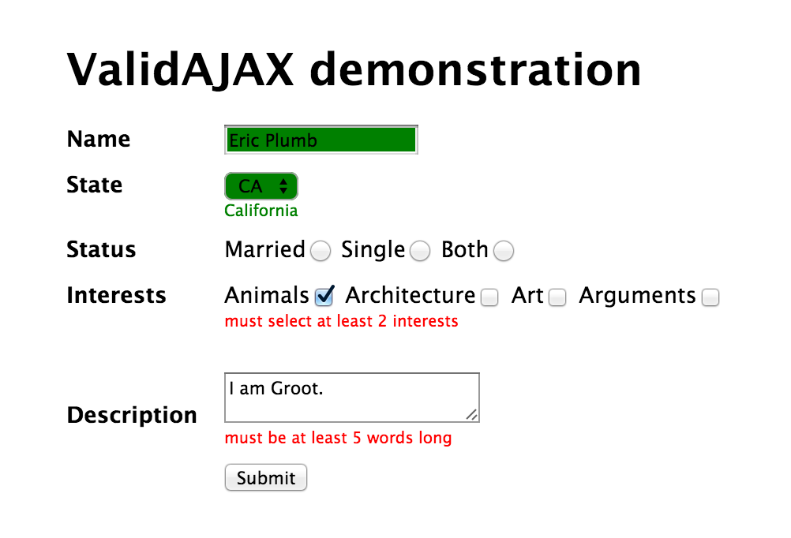

# ValidAJAX

Client-side real-time form validation with no frontend duplication of backend logic.

## About ValidAJAX

ValidAJAX is a minimal framework to validate HTML forms in real-time (as the user selects values or changes focus from 
an input.) It uses AJAX endpoints (one per input) for validation instead of Javascript functions, meaning you can use
the same server-side logic that will process the form when submitted.

ValidAJAX requires [jQuery](//jquery.org) 1.10 or higher.

## Installation

1. Download or copy [validajax.js](src/javascript/validajax.js) onto your server.
1. Include it in a `<script>` tag in the `<head>` of the page(s) containing forms you want to validate, lower on the 
   page than your jQuery `<script>` tag.
1. I mean, it's not rocket science.  The harder part is....

## Initialization

ValidAJAX will create a `window.ValidAJAX` object with a single function `init`. Call this function on `document.load`
or whenever your forms have been rendered.  E.g.:

```javascript
  ValidAJAX.init({
    debugOptions: true,
    validationURLPrefix: '/api/forms'
  });
```

Well, that's not really helpful, I suppose; better to describe....

## Usage

By default, ValidAJAX will run for any form with a `validate` attribute that is not `validate="false"`.  Each time the
user a) makes a selection from a `select`, `input[type="radio"]`, or `input[type="checkbox"]` or b) blurs (tabs or 
clicks out of) another input, ValidAJAX will call the AJAX endpoint for that input.

The endpoint should return a JSON object with a `success` attribute set to `true` for validation success or `false` for
failure, plus an optional `message` attribute which will (by default) be wrapped in a `<span class="validajax">` and
appended to the input.

When the form is submitted, any inputs that have not yet been validated will be, and submission will be prevented if any
fail validation.

## Demo

The [sample](sample/) directory contains an [Express.js](http://expressjs.com/) demo
application which will display and validate a simple form using manually generated server-side validators.



If you want to make any changes to the source code while playing with the demo app you will need to symlink
`src/javascript/validajax.js` to `sample/public/javascripts/validajax.js` for your changes to take effect.

## Customization

### Options

ValidAJAX provides the following options which can be passed to `init`:

#### `debugOptions`

If `true`, attaches the `options` object to `window.ValidAJAX` for debugging purposes.  Defaults to `false`

#### `formSelector`

jQuery selector for the forms for which ValidAJAX will be enabled.  Defaults to `form[validate]:not([validate="false"])` 

#### `inputSelector`

jQuery selector for the inputs which will be validated within a form.  Defaults to 
`input[type="text"], input[type="radio"], input[type="checkbox"], textarea, select`

#### `inputFilter`

jQuery sub-selector which will be appended to each individual selector in `inputSelector`.  You can use this to turn
off validation for individual inputs.  Defaults to `:not(validate="false")`

#### `validationURLPrefix`

Relative URL prefix for the AJAX endpoints used to validate the form, **without a trailing slash**.  Defaults to 
`/ajax/validation`

Consists of the bolded part of this sample endpoint URL: **/ajax/validation**/myform/first_name

#### `validClass`

Added to inputs whose validation succeeds.  Defaults to `valid`

#### `invalidClass`

Added to inputs whose validation fails.  Defaults to `invalid`

### Callbacks

Also on the `options` object passed to `init()`, these callbacks allow you to customize the behavior of ValidAJAX.
 
#### `getURLNamespace($input)`
 
Should return the "namespace" for this input's (and likely for the whole form's) validation URL, appended to 
`validationURLPrefix`.  By default returns the first attribute found of `data-validajax-namespace`, `name`, and `id` on
the input's form.

Consists of the bolded part of this sample endpoint URL: /ajax/validation/**myform**/first_name

#### `getURLEndpoint($input)`

Should return the endpoint for this input's validation URL, appended to `validationURLPrefix` and the result of
calling `getURLNamespace()` for this input.  By default returns the input's `name` attribute.

Consists of the bolded part of this sample endpoint URL: /ajax/validation/myform/**first_name**

#### `removeValidationResidue($input)`

Called before validating the input, and should undo any changes to the input or its parents or siblings made by previous
validations.  By default:

 - removes the data attribute which ValidAJAX uses as a sentinel to prevent multiple simultaneous validations
 - removes `validClass` and `invalidClass` from the input
 - removes the `<span class="validajax">` appended by validation

#### `onValidationSuccess($input, message)`

Called when validation succeeds for an input.  Use this to style the valid input any way you choose.  By default:
 
 - adds `validClass` to the input
 - appends a `<span class="validajax">` with the validation message (if any) to the input (or last in the group if a
   checkbox or radio)

#### `onValidationFailure($input, message)`

Called when validation fails for an input.  Use this to style the error input any way you choose.  By default:
 
 - adds `invalidClass` to the input
 - appends a `<span class="validajax">` with the validation message (if any) to the input (or last in the group if a
   checkbox or radio)
   
### Events

ValidAJAX sends custom events you can listen to in order to customize its behavior even more.  For example, the sample
 application uses `beforeFormInitialization` and `afterFormInitialization` to add the `validating` class to the form,
 which allows us to mask it off via CSS during validation.

#### `beforeFormInitialization.validajax`

Sent before each form is initialized during `init()`. Bound to the form object. No additional parameters.

#### `afterFormInitialization.validajax`

Sent after each form is initialized.  Bound to the form object.  No additional parameters.

#### `beforeInputValidation.validajax`

Sent before each input is validated.  Bound to the input object.  No additional parameters.

#### `afterInputValidation.validajax`

Sent after each input is validated.  Bound to the input object.  Sends the response from the validation endpoint as a
custom parameter.  Example:

```javascript
$('[name="first_name"]').on('afterInputValidation.validajax', function (event, response) {
  if (response.success) console.log("Congratulations!  Your first name is valid!");
  else console.log("Condolences:", response.message)
});
```

#### `beforeSubmitValidation.validajax`

Sent before an entire form is validated on submit.  Bound to the form object.  No additional parameters.

#### `afterSubmitValidation.validajax`

Sent after the form's submit validation is finished.  Bound to the form object.  Sends one additional boolean parameter
which represents whether the form validated successfully or not.

## FAQ

### So I have to create all these validation endpoints by hand?

We probably wouldn't use ValidAJAX either if we had to do that.  We have created (or want to create) plugins for some
popular frameworks which will generate these for you automatically:

 - Django: django_validajax (forthcoming)
 - Rails: rails_validajax (forthcoming)

### Why isn't my form validating?

Did you [install](#installation) and [initialize](#initialization) ValidAJAX?  Does your form have a `validate`
attribute?  (After enabling `debugOptions`) Does `$(ValidAJAX.options.formSelector)` find your form?

### Why do you use GET to validate the inputs?

1. Because that's correct HTTP semantics since we're not changing anything on the server.
1. So you can implement caching on the endpoints for faster performance.

### Isn't that insecure?

Yes!  If you don't validate over HTTPS, anyone can see your validation queries.  This would happen regardless of the
 HTTP method, though.  **Don't validate password inputs!**

### What if the validation of one input depends on another?

ValidAJAX doesn't do that ... yet!

### What is planned for the future?

 - Provide installer for grunt, bower, etc. 
 - Validate multiple inputs together, or the whole form at once
 - Encryption of GET params

## Authors

 - [Eric Plumb](https://github.com/professorplumb/)
